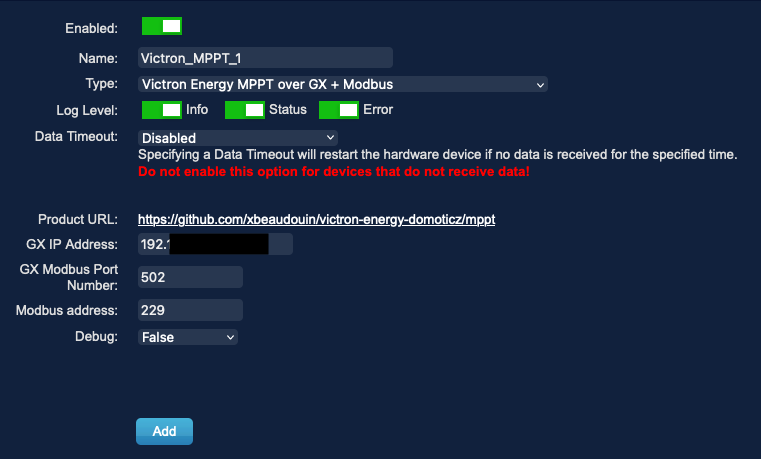
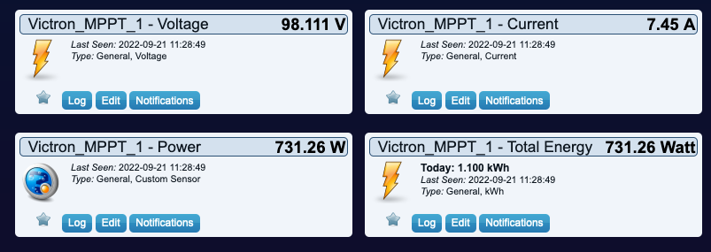
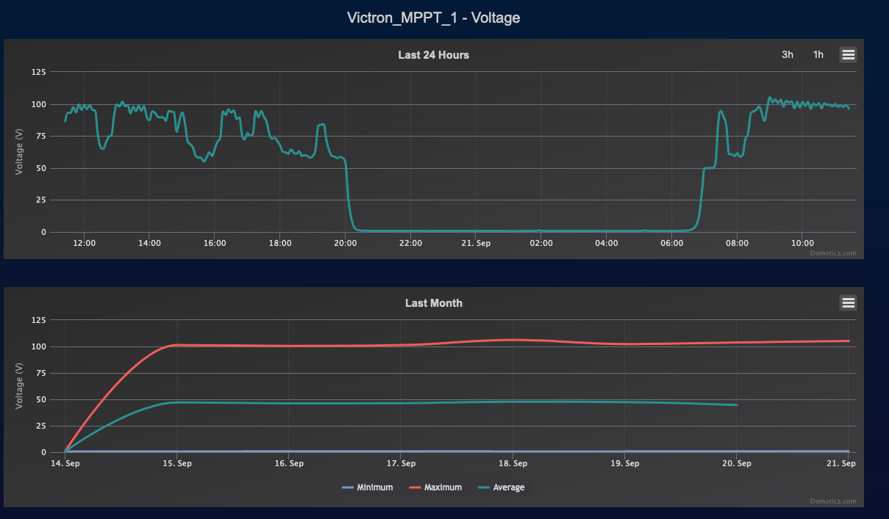
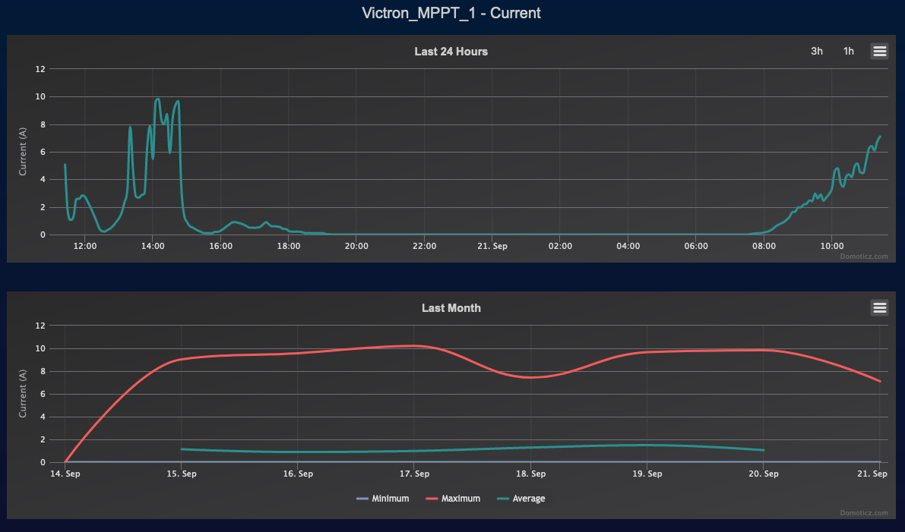
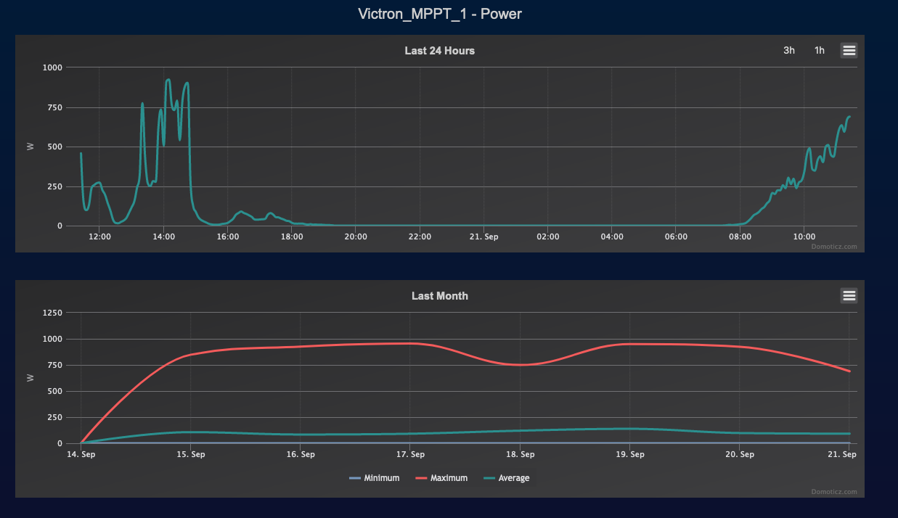

# victron-energy-domoticz

Domoticz plugins for Victron Energy Multiplus and serveral modules that can be reached using modbus

## Requirements

You need to have a Victron Energy GX (what ever the one you have) and have setup
IP on the system.

See [Modbus Configuration](Modbus.md) for more information

## Installation of plugin

Install `pip3`:

``` shell
sudo apt install python3-pip
```

Install `domoticz`:

``` shell
curl -sSL install.domoticz.com | sudo bash
```

Make sure that the `plugins` folder exists in the `domoticz` folder.

Install the plugin:

``` shell
cd domoticz
git clone https://github.com/xbeaudouin/victron-energy-domoticz.git
cd plugins
ln -s ../victron-energy-domoticz/mppt .
```

Go to the plugin folder and install all required addons:

``` shell
cd domoticz/plugins/mppt
sudo pip3 install -r requirements.txt
```

Once that is done, restart domoticz:

``` shell
sudo service domoticz.sh restart
```

## MPPT plugin

Once plugins installed, a new hardware will be available : 'Victron Energy MPPT over GX + Modbus"

To add the MPPT plugin add the following :
- Name : Victron_MPPT_1 (for example)
- GX IP Address : the IP address of your GX
- GX port Number : 502 should good (this is the default, but in case of this change)
- Modbus address : 229 (or depending of your setup you can have several MPPT on your system, adapt it as you need)
- If you want plenty of debug stuff (usefull to fix a bug) you can enable that.

### MPPT Screenshot

MPPT Setup 



MPPT Devices



MPPT Voltage



MPPT Current



MPPT Power



MPPT kWh


